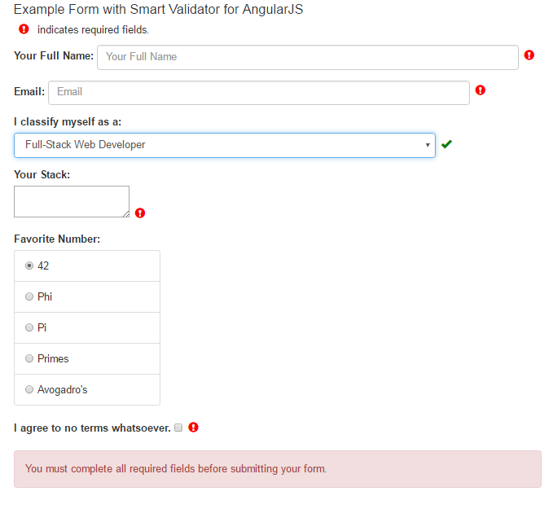

# SmartValidator
A JavaScript validator that works with dynamic form elements created by MV* frameworks such as KnockoutJS and AngularJS.

##Usage
```
// For Angular frameworks, inject `$smartValidator` into your controller 
// and call the `init` method with the form ID or form element reference, plus optional settings overrides.
// For example we inject $smartValidator into an Angular controller:
angular.module('app', ['smart.validator'])

    .controller('contactCtrl', ['$scope', '$smartValidator', function($scope, $smartValidator){
        
        $scope.favNumbers = ['42', 'Phi', 'Pi', 'Primes', 'Avogadro\'s'];
        $scope.FullName = null;
        $scope.Email = null;
        $scope.FavoriteNumber = $scope.favNumbers[0];
        $scope.Agreement = false;
        $scope.Stack = null;
        $scope.Classification = null;
        $scope.complete = false;
        
        $scope.submit = function(){
            // Submit form data
            return false;    
        };
        
        // Example options overrides
        var opts = {
            // Overrides for required input selector
            // The default is `*.required,*[required],*[data-required],*[data-ng-required],*[ng-required]`
            selector: '*[required]',

            // Some action to take when the form is complete/valid.
            callback: function (complete, totalRequired, totalIncomplete, $smartValidator) {
                // Show the Submit button if the form is complete.
                $scope.complete = complete;
            },

            // The interval (in milliseconds) to run the validator
            interval: 100
        };
        
        // Initialize the validator
        $smartValidator.validate('form_container', opts);
        
    }]);

// Simply instantiate `SmartValidator` for non-Angular frameworks
if(!angular){
    //var sv = new SmartValidator();
    //sv.init(/*element/id*/'form_container', /*opts:*/ {});
}
```

###Example Form


###Copyright
The MIT License (MIT)
    
<https://tldrlegal.com/license/mit-license>

Copyright (c) 2015 John T. Bonfardeci
     
Permission is hereby granted, free of charge, to any person obtaining a copy of this software and associated documentation files (the "Software"), to deal in the Software without restriction, including without limitation the rights to use, copy, modify, merge, publish, distribute, sublicense, and/or sell copies of the Software, and to permit persons to whom the Software is furnished to do so, subject to the following conditions:
 
The above copyright notice and this permission notice shall be included in all copies or substantial portions of the Software.

THE SOFTWARE IS PROVIDED "AS IS", WITHOUT WARRANTY OF ANY KIND, EXPRESS OR IMPLIED, INCLUDING BUT NOT LIMITED TO THE WARRANTIES OF MERCHANTABILITY, 
FITNESS FOR A PARTICULAR PURPOSE AND NONINFRINGEMENT. IN NO EVENT SHALL THE AUTHORS OR COPYRIGHT HOLDERS BE LIABLE FOR ANY CLAIM, DAMAGES OR OTHER 
LIABILITY, WHETHER IN AN ACTION OF CONTRACT, TORT OR OTHERWISE, ARISING FROM, OUT OF OR IN CONNECTION WITH THE SOFTWARE OR THE USE OR OTHER 
DEALINGS IN THE SOFTWARE.
